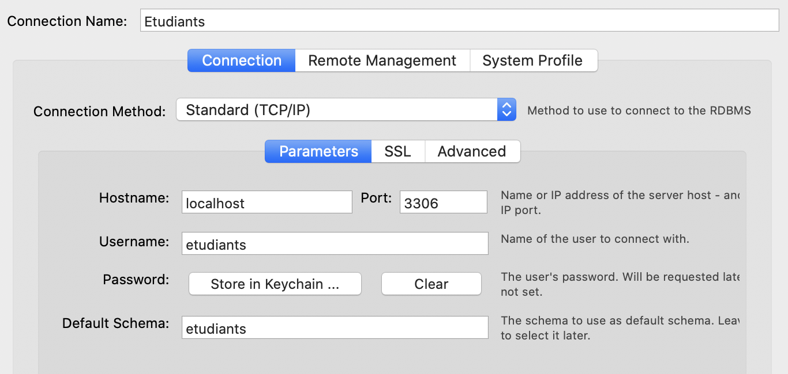
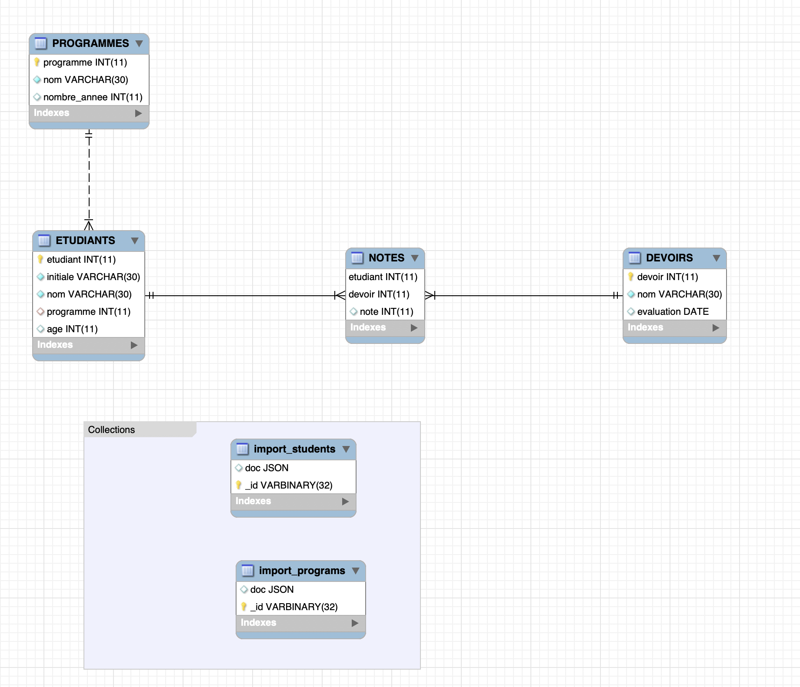

# Etudiants

### :zero: Administration

- [x] Créer son projet dans un répertoire :id:

```
$ cd ~/Developer/INF1086-200-20H-02/4.SQL-NoSQL
$ mkdir <id> && cd <id>
```


- [x] Créer le conteneur avec un volume (dans le répertoire de son projet)

:bangbang: Donner le nom du répertoire source à la variable `SRC` (respectez les backticks)

<sup>:m:</sup> sous `gitbash` afficher le format Windows `-W`

```
$ SRC=`pwd -W`
```


```
PS> $SRC = $PWD.Path | Foreach-Object {$_ -replace '\\','/'}
```

<sup>:m:</sup> sous un terminal classique afficher le format (Linux, MacOS)

```
$ SRC=`pwd -L`
```

:bulb: Le volume sert à charger le fichier `.json`

```
$ docker container run \
         --name some-mysqlds \
         --env MYSQL_ROOT_PASSWORD=password \
         --publish 3306:3306 \
         --publish 33060:33060 \
         --volume ${SRC}:/var/lib/mysql-files \
         --detach \
         mysql/mysql-server:latest
```


```
PS > docker container run `
         --name some-mysqlds `
         --env MYSQL_ROOT_PASSWORD=password `
         --publish 3306:3306 `
         --publish 33060:33060 `
         --volume ${SRC}:/var/lib/mysql-files `
         --detach `
         mysql/mysql-server:latest
```

* En éxécutant la commande suivante vos fichiers dans les conteneurs devraient s'afficher

```
$ docker container exec --interactive some-mysqlds sh -c "ls /var/lib/mysql-files"
300098957-data.sql
300098957-dump.sql
300098957-schema.sql
README.md
images
students.json
```


- [x] Création de la base de données `Etudiants`

```
$ docker container exec --interactive some-mysqlds mysql --user root -ppassword \
                        --execute "CREATE DATABASE etudiants;"
```

- [x]  DCL création de l'utilisateur

:pushpin: Contexte permettant d'utiliser `mysqlsh` 

```
$ docker container exec --interactive some-mysqlds mysql --user root -ppassword \
                        --execute "CREATE USER 'etudiants'@'127.0.0.1' IDENTIFIED BY 'etudiants_1';"
$ docker container exec --interactive some-mysqlds mysql --user root -ppassword \
                        --execute "GRANT ALL ON etudiants.* TO 'etudiants'@'127.0.0.1';"
```

:pushpin: Contexte permettant d'utiliser `Mysql Workbench` 


```
$ docker container exec --interactive some-mysqlds mysql --user root -ppassword \
                        --execute "CREATE USER 'etudiants'@'%' IDENTIFIED BY 'etudiants_1';"
$ docker container exec --interactive some-mysqlds mysql --user root -ppassword \
                        --execute "GRANT ALL ON etudiants.* TO 'etudiants'@'%';"
```

### :one: Migration

:bulb: Récupération et chargement de la base de données `Etudiants`

- [x] Charger le `schema`

```
$ docker container exec --interactive some-mysqlds mysql --user root -ppassword \
          etudiants < ~/Developer/INF1086-200-20H-02/4.SQL-NoSQL/300098957/300098957-schema.sql
```

- [x] Charger les données SQL

```
$ docker container exec --interactive some-mysqlds mysql --user root -ppassword \
         etudiants < ~/Developer/INF1086-200-20H-02/4.SQL-NoSQL/300098957/300098957-data.sql
```

:pushpin:  Vérifier les données SQL en se connectant à Workbench

</img>

### :two: ETL

- [x] Chercher des données `JSON`

[students.json](students.json) * https://codebeautify.org/jsonviewer/cb5d0fd8

[programs.json](programs.json)

```
$ curl https://open.alberta.ca/dataset/3afb1138-ac83-4981-9177-45b0f9108208/resource/66131de0-996a-49e6-b521-90cadbe9646a/download/rows.json > programs.json
```

- [x] Importer ces données dans vos propres collections

:pushpin: Se connecter au conteneur

```
$ docker container exec --interactive --tty some-mysqlds bash
```

:pushpin: Se connecter à mysql SH en utilisant `JavaScript`

```
bash-4.2# mysqlsh --js --host localhost --user etudiants --password
```

:pushpin: Importer les fichiers `json` (i.e. ETL)

* students.json

```
MySQL JS> util.importJson(
              "/var/lib/mysql-files/students.json", 
              {
                  schema: "etudiants", 
                  collection: "import_students"
              }
          )
```

* programs.json

```
MySQL JS> util.importJson(
              "/var/lib/mysql-files/programs.json", 
              {
                  schema: "etudiants", 
                  collection: "import_programs"
              }
          )
```


:pushpin: Tester la collection

```
MySQL  JS > \use etudiants;
MySQL  JS > db.import_students.find()
```

### :three: Scripting avec API

:pushpin: Utilisation de MySQL Python : XDEVAPI 

- [x] La fonction mashup doit gérer une table produite par des collections

Écrire le programme python [b300098957.py](b300098957.py) permettant de rajouter des étudiants importés par le fichier `students.json`

```
$ docker container exec --interactive some-mysqlds mysqlsh --py \
                        --host localhost --user etudiants -petudiants_1 \
                   < ~/Developer/INF1086-200-20H-02/4.SQL-NoSQL/300098957/b300098957.py
```

### :four: Modèlisation

Le modèle doit comporter l'image du schema et le fichier export :id:-dumb.sql (i.e. forward engineering)

- [x] présenter votre modèle relationel

- [x] présenter votre modèle présentant les collections `dans un dossier`

</img>


### :five: Backup

- [x] Sauvegarder la base de données dans un fichier SQL nommé 🆔-dump.sql
 
```
$ docker container exec some-mysqlds \
    sh -c 'exec mysqldump --user root -p"$MYSQL_ROOT_PASSWORD" etudiants ' \
    > ~/Developer/INF1086-200-20H-02/4.SQL-NoSQL/300098957/300098957-dump.sql
```
