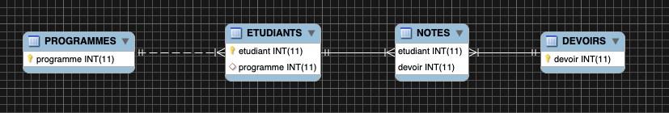

# Etudiants

### :one: Créer le conteneur avec un volume

```
$ docker container run \
         --name some-mysqlds \
         --env MYSQL_ROOT_PASSWORD=password \
         --publish 3306:3306 \
         --publish 33060:33060 \
         --volume ${PWD}:/var/lib/mysql-files \
         --detach \
         mysql/mysql-server:latest
```

### :two: Récupération et chargement de la base de données `Etudiants`

:pushpin: DCL création de la base de données


```
$ docker container exec --interactive some-mysqlds \
                  mysql --user root -ppassword --execute "CREATE DATABASE etudiants;"
```

:pushpin: DCL création de l'utilisateur


```
$ docker container exec --interactive some-mysqlds \
                  mysql --user root -ppassword --execute "CREATE USER 'etudiants'@'%' IDENTIFIED BY 'etudiants_1';"
$ docker container exec --interactive some-mysqlds \
                  mysql --user root -ppassword --execute "GRANT ALL ON etudiants.* TO 'etudiants'@'%';"
```





https://codebeautify.org/jsonviewer/cb5d0fd8
