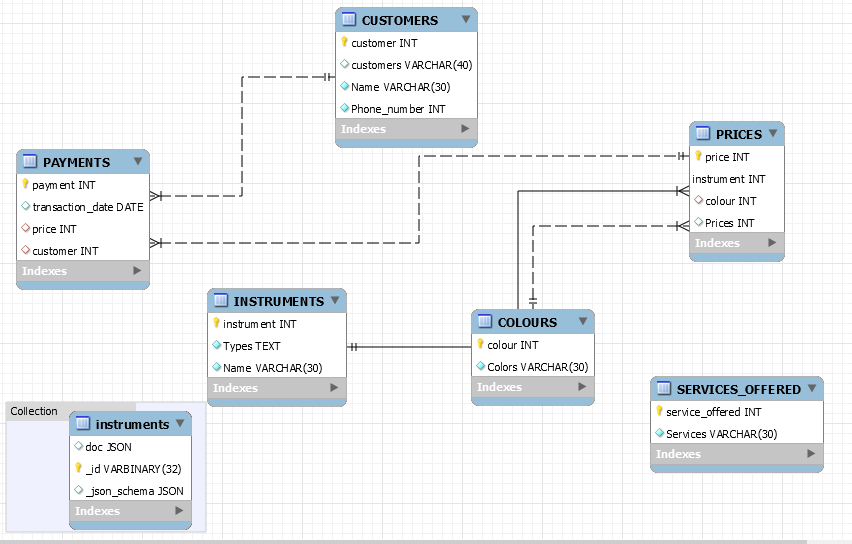

# musicshop

### :zero: Administration

- [] Créer son projet dans un répertoire :id:

```
$ cd ~/Developer/INF1086-200-20H-02/4.SQL-NoSQL
$ mkdir 300105201 && cd 300105201
```


- [] Créer le conteneur avec un volume (dans le répertoire de son projet)


:bulb: Le volume sert à charger le fichier `.json`


<sup>:m:</sup> sous `Powershell`

```
PS > docker container run `
         --name some-mysqlds `
         --env MYSQL_ROOT_PASSWORD=password `
         --publish 3306:3306 `
         --publish 33060:33060 `
         --volume  C:\Users\user\developer\INF1086-200-20H-02\4.SQL-NoSQL\300105201>:/var/lib/mysql-files `
         --detach `
         mysql/mysql-server:latest
```

* En éxécutant la commande suivante vos fichiers dans les conteneurs devraient s'afficher

```
$ docker container exec --interactive some-mysqlds sh -c "ls /var/lib/mysql-files"
300105201-data.sql
300105201-schema.sql
README.md
instuments.json
```


- [] Création de la base de données `musicshop`

```
$ docker container exec --interactive some-mysqlds mysql --user root -ppassword \
                        --execute "CREATE DATABASE musicshop;"
```

- []  DCL création de l'utilisateur

:pushpin: Contexte permettant d'utiliser `mysqlsh` 

```
$ docker container exec --interactive some-mysqlds mysql --user root -ppassword \
                        --execute "CREATE USER 'roland'@'127.0.0.1' IDENTIFIED BY 'jacques_1';"
$ docker container exec --interactive some-mysqlds mysql --user root -ppassword \
                        --execute "GRANT ALL ON musicshop.* TO 'roland'@'127.0.0.1';"
```

:pushpin: Contexte permettant d'utiliser `Mysql Workbench` 


```
$ docker container exec --interactive some-mysqlds mysql --user root -ppassword \
                        --execute "CREATE USER 'roland'@'%' IDENTIFIED BY 'jacques_1';"
$ docker container exec --interactive some-mysqlds mysql --user root -ppassword \
                        --execute "GRANT ALL ON musicshop.* TO 'roland'@'%';"
```

### :one: Migration

:bulb: Récupération et chargement de la base de données `musicshop`

- [] Charger le `schema`

```
$ docker container exec --interactive some-mysqlds mysql --user root -ppassword \
          musicshop < ~/Developer/INF1086-200-20H-02/4.SQL-NoSQL/300105201/300105201-schema.sql
```

- [] Charger les données SQL

```
$ docker container exec --interactive some-mysqlds mysql --user root -ppassword \
         musicshop < ~/Developer/INF1086-200-20H-02/4.SQL-NoSQL/300105201/300105201-data.sql
```

### :two: ETL

- [] Chercher des données `JSON`

```
$ curl https://raw.githubusercontent.com/dariusk/corpora/master/data/music/instruments.json > instruments.json
```

- [] Importer ces données dans vos propres collections

:pushpin: Se connecter au conteneur

```
$ docker container exec --interactive --tty some-mysqlds bash
```

:pushpin: Se connecter à mysql SH en utilisant `JavaScript`

```
bash-4.2# mysqlsh --js --host localhost --user roland -pjacques_1
```

:pushpin: Importer les fichiers `json` (i.e. ETL)

* instruments.json

```
MySQL JS> util.importJson(
              "/var/lib/mysql-files/instruments.json", 
              {
                  schema: "musicshop", 
                  collection: "instruments"
              }
          )
```

:pushpin: Tester la collection

```
MySQL  JS > \use musicshop
MySQL  JS > db.instruments.find()
```

### :three: Scripting avec API

:pushpin: Utilisation de MySQL Python : XDEVAPI 

- [x] La fonction mashup doit gérer une table produite par des collections

Écrire le programme python [b300105201.py](b300105201.py) permettant de rajouter des étudiants importés par le fichier `products.json`

```
$ docker container exec --interactive some-mysqlds mysqlsh --py \
                        --host localhost --user roland -pjacques_1 \
                   < ~/Developer/INF1086-200-20H-02/4.SQL-NoSQL/300105201/b300105201.py
```

### :four: Modèlisation

Le modèle doit comporter l'image du schema et le fichier export :id:-dumb.sql (i.e. forward engineering)

- [] présenter votre modèle relationel

- [] présenter votre modèle présentant les collections `dans un dossier`

</img>


### :five: Backup

- [x] Sauvegarder la base de données dans un fichier SQL nommé 🆔-dump.sql
 
```
$ docker container exec some-mysqlds \
    sh -c 'exec mysqldump --user root -p"$MYSQL_ROOT_PASSWORD" musicshop ' \
    > ~/Developer/INF1086-200-20H-02/4.SQL-NoSQL/300105201/300105201-dump.sql
```
