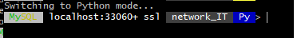
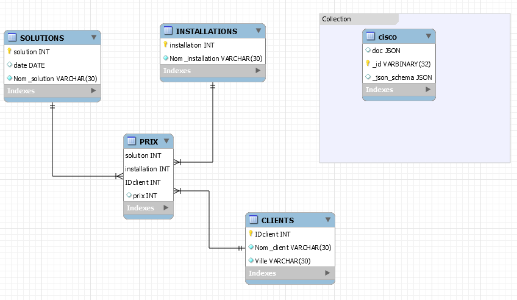

# Administration
Créer votre base de données MySQL/Server
# Créer le conteneur avec un volume
 
$ docker container run \
         --name some-mysqlds \
         --env MYSQL_ROOT_PASSWORD=password \
         --publish 3306:3306 \
         --publish 33060:33060 \
         --volume ${SRC}:/var/lib/mysql-files \
         --detach \
         mysql/mysql-server:latest
         
         
## Création de la base de données network_IT
$ docker container exec --interactive some-mysqlds mysql --user root -ppassword \
                        --execute "CREATE DATABASE network_IT;"
                        
## DCL création de l'utilisateur
$ docker container exec --interactive some-mysqlds mysql --user root -ppassword \
                        --execute "CREATE USER 'AEK'@'127.0.0.1' IDENTIFIED BY 'etudiants_1';"
                        
$ docker container exec --interactive some-mysqlds mysql --user root -ppassword \
                        --execute "GRANT ALL ON network_IT.* TO 'AEK'@'127.0.0.1';"

# Contexte permettant d'utiliser Mysql Workbench

$ docker container exec --interactive some-mysqlds mysql --user root -ppassword \
                        --execute "CREATE USER 'AEK'@'%' IDENTIFIED BY 'etudiants_1';"
                        
$  docker container exec --interactive some-mysqlds mysql --user root -ppassword \
                        --execute "GRANT ALL ON network_IT.* TO 'AEK'@'%';"

# Migration

# Charger le schema

$ docker container exec --interactive some-mysqlds mysql --user root -ppassword \
          network_IT < ~/Developer/INF1086-200-20H-02/4.SQL-NoSQL/300106918/300106918-schema.sql

##  Charger les données SQL
$ docker container exec --interactive some-mysqlds mysql --user root -ppassword \
          network_IT < ~/Developer/INF1086-200-20H-02/4.SQL-NoSQL/300106918/300106918-data.sql

##  Se connecter au conteneur
   $  docker container exec --interactive --tty some-mysqlds bash
     
##  Se connecter à mysql SH en utilisant 
     $  mysqlsh --js --host localhost --user AEK --password
 #
       
  #
       
       
#  Importer les fichiers json (i.e. ETL)

$ cisco.json
MySQL JS> util.importJson(
              "/var/lib/mysql-files/cisco.json" 
              {
                  schema: "network_IT"
                  collection: "cisco"
              }
          )

# Tester la collection

$ MySQL  Py > \use network_IT
$ MySQL  Py > db.cisco.find()

# Utilisation de MySQL Python : XDEVAPI

$ docker container exec --interactive some-mysqlds mysqlsh --py \
                        --host localhost --user AEK -etudiants_1 \
                        < ~/Developer/INF1086-200-20H-02/4.SQL-NoSQL/300106918/b300106918.py
                   
#  Backup, Sauvegarder la base de données dans un fichier SQL nommé ??-dump.sql

$ docker container exec some-mysqlds \
               sh -c 'exec mysqldump --user root -p"$MYSQL_ROOT_PASSWORD" network_IT ' \
                > ~/Developer/INF1086-200-20H-02/4.SQL-NoSQL/300106918/300106918-dump.sql

# Modèlisation

