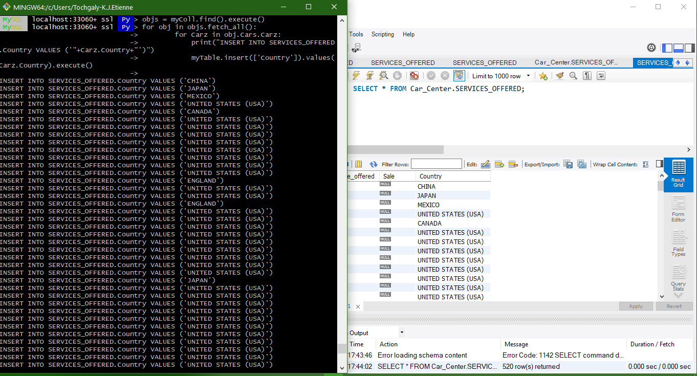
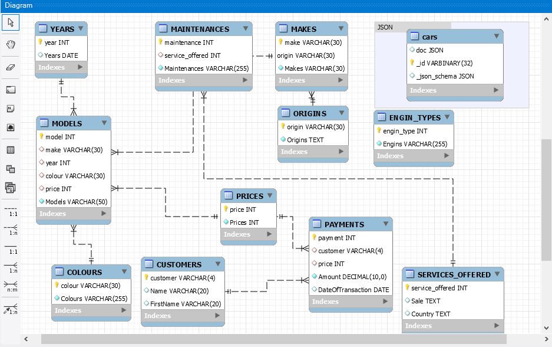

# GAME OVER 

# Projet

:bulb: Creer son projet dans un repertoire avec son :id:

``$ cd ~/Developer/INF1086-200-20H-02/4.SQL-NoSQL``

``$ mkdir 300107361`` && `$ cd 300107361`

### :zero: Administration 

- [x] Créer votre base de données [MySQL/Server](../3.ETL/.docs/MySQLDS.md)

- [x] Assurez vous qu'il utilise un volume pour importer de nouvelles données
 
:bulb:  Le volume sert à charger les fichiers `.json`


* Lancer `PS> pwd` pour avoir le path du fichier pour vous assurez qu'il utilise un volume: 

Sous Powershell 
```
 docker container run `
         --name some-mysqlds `
         --env MYSQL_ROOT_PASSWORD=password `
         --publish 3306:3306 `
         --publish 33060:33060 `
         --volume C:\Users\Tochgaly-K.J.Etienne\developer\INF1086-200-20H-02\4.SQL-NoSQL\300107361:/var/lib/mysql-files `
         --detach `
         mysql/mysql-server:latest
```
* En éxécutant la commande suivante vos fichiers dans les conteneurs devraient s'afficher
```
$ docker container exec --interactive some-mysqlds sh -c "ls /var/lib/mysql-files"

300107361-data.sql
300107361-schema.sql
README.md
b300107361.py
car.json

```

### :one: Migration

- [x] Ceer votre base de données
```
$   docker container exec --interactive some-mysqlds mysql --user root -ppassword \
                          --execute "CREATE DATABASE Car_Center;"

mysql: [Warning] Using a password on the command line interface can be insecure.
```

* Creer l'utilisateur permettant d'acceder au Document Store

:pushpin: Contexte permettant d'utiliser `mysqlsh`

```
$ docker container exec --interactive some-mysqlds mysql --user root -ppassword \
                        --execute "CREATE USER 'joker'@'127.0.0.1' IDENTIFIED BY 'password';"
$ docker container exec --interactive some-mysqlds mysql --user root -ppassword \
                        --execute "GRANT ALL ON Car_Center.* TO 'joker'@'127.0.0.1';"
```

:pushpin: Contexte permettant d'utiliser `Mysql Workbench`


```
$ docker container exec --interactive some-mysqlds mysql --user root -ppassword \
                        --execute "CREATE USER 'joker'@'%' IDENTIFIED BY 'password';"

$ docker container exec --interactive some-mysqlds mysql --user root -ppassword  \
                        --execute "GRANT ALL ON Car_Center.* TO 'joker'@'%';"
```

- [x] Importer votre base de données SQL
- [x] Charger le `schema`
 ```
$  docker container exec --interactive some-mysqlds mysql --user root -ppassword \
              Car_Center < ~/Developer/INF1086-200-20H-02/4.SQL-NoSQL/300107361/300107361-schema.sql

mysql: [Warning] Using a password on the command line interface can be insecure.
```
- [x] Charger les `données` SQL
```
$  docker container exec --interactive some-mysqlds mysql --user root -ppassword \
           Car_Center < ~/Developer/INF1086-200-20H-02/4.SQL-NoSQL/300107361/300107361-data.sql
```


### :two: E.T.L

- [x] Chercher des données `json` correspondant à votre domaine d'activités

Tochgaly-K.J.Etienne@XXX MINGW64 ~/developer/INF1086-200-20H-02/4.SQL-NoSQL/300107361 (master)

```$ curl 'https://vpic.nhtsa.dot.gov/api/vehicles/getallmanufacturers?format=json&page=2' | jq > car.json ```

  % Total    % Received % Xferd  Average Speed   Time    Time     Time  Current
                                 Dload  Upload   Total   Spent    Left  Speed
100 14168  100 14168    0     0  16192      0 --:--:-- --:--:-- --:--:-- 16192

- [x] Importer ces données dans vos propres collections

:a: Se connecter au conteneur
```
* $ docker container exec --interactive --tty some-mysqlds bash

* $ winpty  docker container exec --interactive --tty some-mysqlds bash
```

:b: Se connecter à mysqlSH en utilisant `JavaScript`
```
bash-4.2# mysqlsh --js --user joker -ppassword
```

:ab: Importer les donnees Json
```
 MySQL  localhost:33060+ ssl  JS > util.importJson("/var/lib/mysql-files/car.json", {schema: "Car_Center", collection: "cars"})
Importing from file "/var/lib/mysql-files/car.json" to collection `Car_Center`.`cars` in MySQL Server at localhost:33060

.. 1.. 1
Processed 10.87 KB in 1 document in 0.0563 sec (17.75 documents/s)
Total successfully imported documents 1 (17.75 documents/s)
```

### :three: Scripting avec API

:bulb: En vous aidant de python, démontrer que vous utilisez le XDEVAPI

:pushpin: Nom de fichier votre :id: précéder par un b
[b300107361.py](b300107361.py)
:pushpin: avec un nom de fonction nommé

```python
def mashup():

```

```
$ docker container exec --interactive some-mysqlds mysqlsh --py \
                        --host localhost --user joker -ppassword \
                   < ~/Developer/INF1086-200-20H-02/4.SQL-NoSQL/300107361/b300107361.py
```

- [x] La fonction `mashup` doit créer une table produite par des collections


- J'ai cree la fonction mashup qui permet de rajouter des pays de fabrication de voitures importes par le fichier `car.json` dans la table des services.




### :four: Modelisation

:bulb: À l'aide de MySQL Workbench,

- [x] présenter votre modèle relationel


- [x] présenter votre modèle présentant les collections `dans un dossier`



### :five: Backup

- [x] Sauvegarder la base de données dans un fichier SQL nommé :id:-dump.sql

```
$ docker exec some-mysqlds \
    sh -c 'exec mysqldump --user root -p"$MYSQL_ROOT_PASSWORD" Car_Center ' \
    > ~/Developer/INF1086-200-20H-02/4.SQL-NoSQL/300107361/300107361-dump.sql
```

