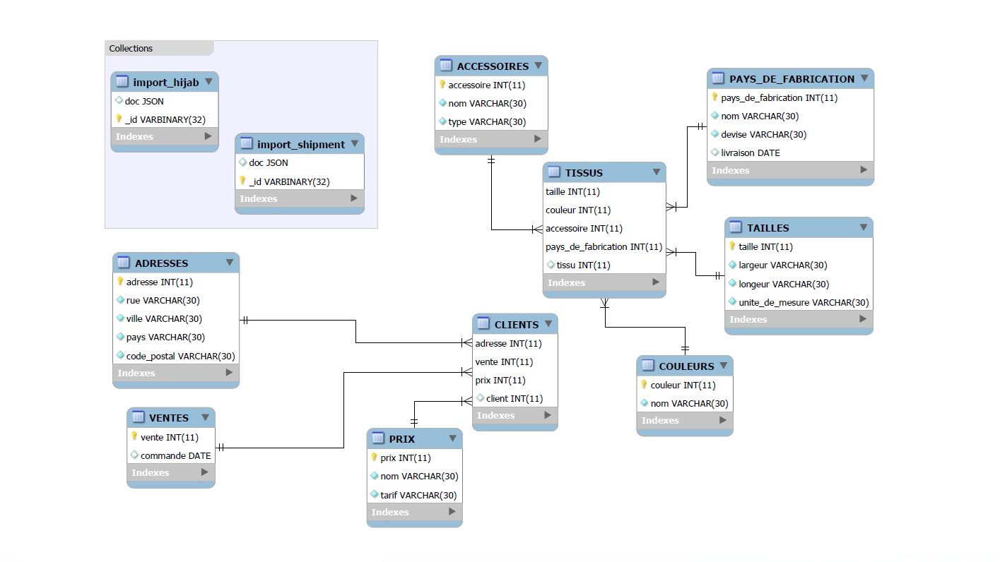

0️⃣ Administration

### 💡 *Create a directory 🆔
```
$ cd ~/Developer/INF1086-200-20H-02/4.SQL-NoSQL
$ mkdir 300108234 cd 300108234
```
### 💡 *Create the container with a volume

```
PS > $SRC = $PWD.Path | Foreach-Object {$_ -replace '\\','/'}	
```

 ##### *sous Powershell

```
PS > docker container run `
         --name some-mysqlds `
         --env MYSQL_ROOT_PASSWORD=password `
         --publish 3306:3306 `
         --publish 33060:33060 `
         --volume ${SRC}:/var/lib/mysql-files `
         --detach `
         mysql/mysql-server:latest
```

### 💡 *Creation of the database

```
 docker container exec --interactive some-mysqlds mysql --user root -ppassword \
>                         --execute "CREATE DATABASE Hijabfashion;"
mysql: [Warning] Using a password on the command line interface can be insecure.
```
### 💡 *DCL user creation

#### 📌To use mysqlsh
```
 docker container exec --interactive some-mysqlds mysql --user root -ppassword \
>                         --execute "CREATE USER 'halima'@'127.0.0.1' IDENTIFIED BY 'password';"
mysql: [Warning] Using a password on the command line interface can be insecure.
```
```
 docker container exec --interactive some-mysqlds mysql --user root -ppassword \
>                         --execute "GRANT ALL ON Hijabfashion.* TO 'halima'@'127.0.0.1';"
mysql: [Warning] Using a password on the command line interface can be insecure.
```


#### 📌To use Mysql Workbench
```
 docker container exec --interactive some-mysqlds mysql --user root -ppassword \
>                         --execute "CREATE USER 'halima'@'%' IDENTIFIED BY 'password';"
mysql: [Warning] Using a password on the command line interface can be insecure.
```
```
 docker container exec --interactive some-mysqlds mysql --user root -ppassword                         --execute "GRANT ALL ON Hijabfashion.* TO 'halima'@'%';"        mysql: [Warning] Using a password on the command line interface can be insecure
```
### :one: Migration

#### 📌Loading schematics
```
docker container exec --interactive some-mysqlds mysql --user root -ppassword           Hijabfashion < ~/Developer/INF1086-200-20H-02/4.SQL-NoSQL/300108234/300108234-schema.sql
mysql: [Warning] Using a password on the command line interface can be insecure.
```

#### 📌Loading des données SQL
```
 docker container exec --interactive some-mysqlds mysql --user root -ppassword           Hijabfashion < ~/Developer/INF1086-200-20H-02/4.SQL-NoSQL/300108234/300108234-data.sql
mysql: [Warning] Using a password on the command line interface can be insecure.

```
### :two: ETL

#### 📌 Connect to the container

```
 winpty docker container exec --interactive --tty some-mysqlds bash
```
#### 📌 Connecting to mysql SH using JavaScript
```
bash-4.2# mysqlsh --js --host localhost --user halima --password
Please provide the password for 'halima@localhost': ********
```

#### 📌 Import json files

* hijab.json

```
MySQL JS> util.importJson(
              "/var/lib/mysql-files/hijab.json", 
              {
                  schema: "Hijabfashion", 
                  collection: "import_hijab"
              }
          )

* shipement.json

```
MySQL JS> util.importJson(
              "/var/lib/mysql-files/shipment.json", 
              {
                  schema: "Hijabfashion", 
                  collection: "import_shipment"
              }
          )

### :three: Scripting avec API

#### :pushpin: Using MySQL Python

```
$ docker container exec --interactive some-mysqlds mysqlsh --py \
                        --host localhost --user halima -ppassword \
                   < ~/Developer/INF1086-200-20H-02/4.SQL-NoSQL/300108234/b300108234.py
```

### :four: Modeling
💡 

</img>


### :five: Backup
 💡 
 
```
$ docker container exec some-mysqlds \
    sh -c 'exec mysqldump --user root -p"$MYSQL_ROOT_PASSWORD" Hijabfashion ' \
    > ~/Developer/INF1086-200-20H-02/4.SQL-NoSQL/300108234/300108234-dump.sql
```

