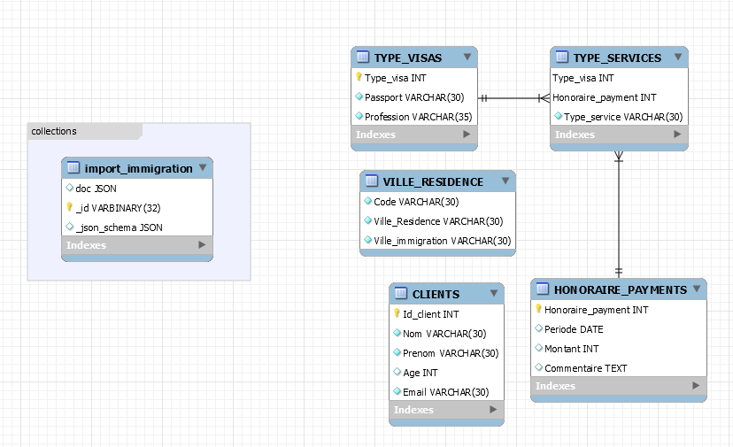

# immigration_consulting

# My Project nosql

gitbash:
```
$ SRC=`pwd -W`
```
:bulb: Creer son projet dans un repertoire avec son :id:
```
``$ cd ~/Developer/INF1086-200-20H-02/4.SQL-NoSQL``

``$ mkdir 300110500`` && `$ cd 300110500`
```


### :zero: Administration 
```
-- creer le container(sous git bash)

$ docker container run \
         --name some-mysqlds \
         --env MYSQL_ROOT_PASSWORD=password \
         --publish 3306:3306 \
         --publish 33060:33060 \
         --volume ${SRC}:/var/lib/mysql-files \
         --detach \
         mysql/mysql-server:latest
    ```
   27a38d871e3d75b1ee2c9b5ba1ee6f7ae20a1b30837cb113b9f30b8deff843fe
```
         
   -- visualiserle  volume pour import
```   
   $ docker container exec --interactive some-mysqlds sh -c "ls /var/lib/mysql-files"
   
300110500-data.sql
300110500-dump.sql
300110500-schema.sql
README.md
b300110500.py
immigration.json
```

- Créer votre base de données[MySQL
```
$ docker container exec --interactive some-mysqlds mysql --user root -ppassword \
              --execute "CREATE DATABASE immigration_consulting;"
```

- création de l'utilisateur
 
📌 Contexte permettant d'utiliser mysqlsh
```
$ docker container exec --interactive some-mysqlds mysql --user root -ppassword \
                        --execute "CREATE USER 'guigma'@'127.0.0.1' IDENTIFIED BY 'password';"
$ docker container exec --interactive some-mysqlds mysql --user root -ppassword \
                        --execute "GRANT ALL ON immigration_consulting.* TO 'guigma'@'127.0.0.1';"
 ```                       
 📌 Contexte permettant d'utiliser Mysql Workbench
```
$ docker container exec --interactive some-mysqlds mysql --user root -ppassword \
                        --execute "CREATE USER 'guigma'@'%' IDENTIFIED BY 'password';"
$ docker container exec --interactive some-mysqlds mysql --user root -ppassword \
                       --execute "GRANT ALL ON immigration_consulting.* TO 'guigma'@'%';"
```                    
 ### :one: Migration
                                
    💡 Récupération et chargement de la base de données Etudiants

 Charger le schema
 ```
$ docker container exec --interactive some-mysqlds mysql --user root -ppassword \
          immigration_consulting < ~/Developer/INF1086-200-20H-02/4.SQL-NoSQL/300110500/300110500-schema.sql                     
```
Charger les données SQL
```
$ docker container exec --interactive some-mysqlds mysql --user root -ppassword \
        immigration_consulting  < ~/Developer/INF1086-200-20H-02/4.SQL-NoSQL/300110500/300110500-data.sql
```

- [ ] Importer votre base de données SQl

### :two: E.T.L
```
$ winpty docker container exec --interactive --tty some-mysqlds bash
# bash-4.2# mysqlsh --js --host localhost --user guigma --password
```

- [ ] Importer ces données dans vos propres collections
```
util.importJson(               "/var/lib/mysql-files/immigr
ation.json",                {                   schema: "immigration_consulting",
       collection: "import_immigration"               }           )
```

### :three: Scripting avec API
```
$ docker container exec --interactive some-mysqlds mysqlsh --py                         --host localhost --user guigma -ppassword                    < ~/Developer/INF1086-200-20H-02/4.SQL-NoSQL/300110500/b300110500.py
WARNING: Using a password on the command line interface can be insecure.
```


### :four: Modelisation

</img>


### :five: Backup
```
$ docker container exec some-mysqlds     sh -c 'exec mysqldump --user root -p"$MYSQL_ROOT_PASSWORD" immigration_consulting '     > ~/Developer/INF1086-200-20H-02/4.SQL-NoSQL/300110500/300110500-dump.sql
mysqldump: [Warning] Using a password on the command line interface can be insecure.
```


