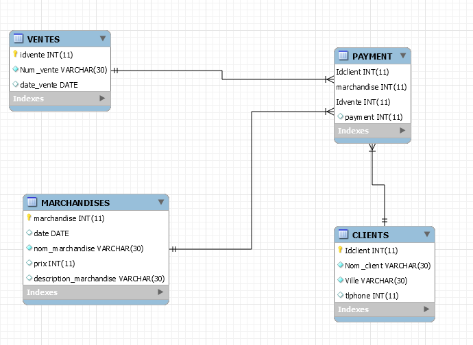

# Carte_graphique

### :zero: Administration 

Créer son répertoire avec son :id:

```
$ cd ~/Developer/INF1086-200-20H-02/4.SQL-NoSQL
$ mkdir <300110529>
cd <300110529>
```

### :one: Créer le conteneur dans le répertoire

```
$ docker container run `
         --name some-mysqlds `
         --env MYSQL_ROOT_PASSWORD=password `
         --publish 3306:3306 `
         --publish 33060:33060 `
         --volume C:\Users\THK\developer\INF1086-200-20H-02\4.SQL-NoSQL\300110529:/var/lib/mysql-files `
         --detach `
         mysql/mysql-server:latest
```

Verification des fichiers dans le conteneurs 

```
$ docker container exec --interactive some-mysqlds sh -c "ls /var/lib/mysql-files"
300110529-data.sql
300110529-schema.sql
README.md
Carte_graphique.json
```

### :two: Migration

Création de la base de données `Carte_graphique`

```
$ docker container exec --interactive some-mysqlds mysql --user root -ppassword \
                        --execute "CREATE DATABASE Carte_graphique;"
```
création de l'utilisateur

```
$ docker container exec --interactive some-mysqlds mysql --user root -ppassword \
                        --execute "CREATE USER 'THK'@'127.0.0.1' IDENTIFIED BY 'password';"
$ docker container exec --interactive some-mysqlds mysql --user root -ppassword \
                        --execute "GRANT ALL ON Carte_graphique.* TO 'THK'@'127.0.0.1';"
```

utilisation `Mysql Workbench`

```
$ docker container exec --interactive some-mysqlds mysql --user root -ppassword \
                        --execute "CREATE USER 'THK'@'%' IDENTIFIED BY 'password';"

$ docker container exec --interactive some-mysqlds mysql --user root -ppassword  \
                        --execute "GRANT ALL ON Carte_graphique.* TO 'THK'@'%';"
```

Importation de la base de données SQL

```
$ docker container exec --interactive some-mysqlds mysql --user root -ppassword \
          Carte_graphique < ~/Developer/INF1086-200-20H-02/4.SQL-NoSQL/300110529/300110529-schema.sql
```

Charger les `données` SQL

```
$  docker container exec --interactive some-mysqlds mysql --user root -ppassword \
           Carte_graphique < ~/Developer/INF1086-200-20H-02/4.SQL-NoSQL/300110529/300110529-data.sql
```

### :three: E.T.L

Recherche du fichier `json` Carte_graphique

Importation du fichier dans notre collections

Se connecter au conteneur

```
* $ docker container exec --interactive --tty some-mysqlds bash

* $ winpty  docker container exec --interactive --tty some-mysqlds bash
```

Se connecter à mysqlSH en utilisant `JavaScript`

```
bash-4.2# mysqlsh --js --user THK -ppassword
```

Importation du fichier Json

```
MySQL JS> util.importJson(
              "/var/lib/mysql-files/Carte_graphique.json", 
              {
                  schema: "Carte_graphique", 
                  collection: "Carte_graphique"
              }
          )
```

### :four: Scripting avec API

Utilisation de MySQL Python : XDEVAPI

```
$ docker container exec --interactive some-mysqlds mysqlsh --py \
                        --host localhost --user THK -ppassword \
                   < ~/Developer/INF1086-200-20H-02/4.SQL-NoSQL/300110529/b300110529.py
```

Cela permet d'écrire le programme python b300110529.py qui vas rajouter les details des cartes graphiques importés par le fichier `Carte_graphique.json`

### Renomer le fichier avec votre numero précéder par un "b" b300110529.py

### :five: Modèlisation

</img>

### Pour le backup

```
docker container exec some-mysqlds \
    sh -c 'exec mysqldump --user root -p"$MYSQL_ROOT_PASSWORD" Carte_graphique ' \
    > ~/Developer/INF1086-200-20H-02/4.SQL-NoSQL/300110529/300110529-dump.sql    
   
```
