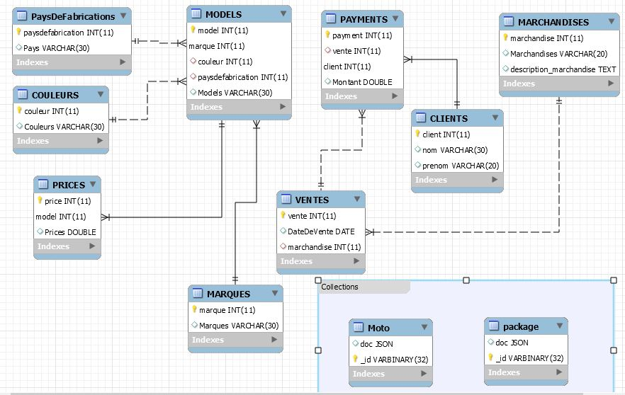

# Base de donnée magasin

### :1: Administration

- 😍 Créer son projet dans un répertoire :id:

```
$ cd ~/Developer/INF1086-200-20H-02/4.SQL-NoSQL
$ mkdir 300112017 && cd 300112017
```


- ☠ Créer le conteneur avec un volume (dans le répertoire de son projet)


👉 Le volume sert à charger le fichier `.json`

🎅 sous `Powershell`

```
PS > docker container run `
         --name some-mysqlds `
         --env MYSQL_ROOT_PASSWORD=password `
         --publish 3306:3306 `
         --publish 33060:33060 `
         --volume C:\Users\Ador\developer\INF1086-200-20H-02\4.SQL-NoSQL\300112017:/var/lib/mysql-files `
         --detach `
         mysql/mysql-server:latest
```

🚗 En éxécutant cette commande qui suive vos fichiers dans les conteneurs devraient s'afficher comme ceci

```
$ docker container exec --interactive some-mysqlds sh -c "ls /var/lib/mysql-files"
300112017-data.sql
300112017-schema.sql
README.md
Moto.json
```


🌞 Création de ma base de données `magasin`

```
$ docker container exec --interactive some-mysqlds mysql --user root -ppassword \
                        --execute "CREATE DATABASE magasin;"
```

 🕕 création de l'utilisateur

```
$ docker container exec --interactive some-mysqlds mysql --user root -ppassword \
                        --execute "CREATE USER 'ador'@'127.0.0.1' IDENTIFIED BY 'password';"
$ docker container exec --interactive some-mysqlds mysql --user root -ppassword \
                        --execute "GRANT ALL ON magasin.* TO 'ador'@'127.0.0.1';"
```

:pushpin: Contexte permettant d'utiliser `Mysql Workbench` 


```
$ docker container exec --interactive some-mysqlds mysql --user root -ppassword \
                        --execute "CREATE USER 'ador'@'%' IDENTIFIED BY 'password';"
$ docker container exec --interactive some-mysqlds mysql --user root -ppassword \
                        --execute "GRANT ALL ON magasin.* TO 'ador'@'%';"
```

### :one: Migration

:bulb: Récupération et chargement de la base de données `magasin`

- [] Charger le `schema`

```
$ docker container exec --interactive some-mysqlds mysql --user root -ppassword \
          magasin < ~/Developer/INF1086-200-20H-02/4.SQL-NoSQL/300112017/300112017-schema.sql
```

- [] Charger les données SQL

```
$ docker container exec --interactive some-mysqlds mysql --user root -ppassword \
         magasin < ~/Developer/INF1086-200-20H-02/4.SQL-NoSQL/300112017/300112017-data.sql
```

### :two: ETL

- [] Chercher des données `JSON`

```
$ curl https://raw.githubusercontent.com/MarinescuEvghenii/Cars-Motorcycles-DataBase-JSON/master/moto_brands.json > Moto.json
```

- [] Importer ces données dans vos propres collections

:pushpin: Se connecter au conteneur

```
$ docker container exec --interactive --tty some-mysqlds bash
```

:pushpin: Se connecter à mysql SH en utilisant `JavaScript`

```
bash-4.2# mysqlsh --js --host localhost --user ador --password
```

:pushpin: Importer les fichiers `json` (i.e. ETL)

* Moto.json

```
MySQL JS> util.importJson(
              "/var/lib/mysql-files/Moto.json", 
              {
                  schema: "magasin", 
                  collection: "Moto"
              }
          )
```

:pushpin: Tester la collection

```
MySQL  JS > \use magasin
MySQL  JS > db.Moto.find()
```
### :three: Scripting avec API

:pushpin: Utilisation de MySQL Python : XDEVAPI 

- [x] La fonction mashup doit gérer une table produite par des collections

Écrire le programme python [b300112017.py](b300112017.py) permettant de rajouter des étudiants importés par le fichier `Moto.json`

```
$ docker container exec --interactive some-mysqlds mysqlsh --py \
                        --host localhost --user ador -password \
                   < ~/Developer/INF1086-200-20H-02/4.SQL-NoSQL/300112017/b300112017.py
```

### :four: IMAGE

</img>


### :five: Backup

-Sauvegarder la base de données dans un fichier SQL nommé 🆔-dump.sql
 
```
$ docker container exec some-mysqlds \
    sh -c 'exec mysqldump --user root -p"$MYSQL_ROOT_PASSWORD" magasin ' \
    > ~/Developer/INF1086-200-20H-02/4.SQL-NoSQL/300112017/300112017-dump.sql
```
