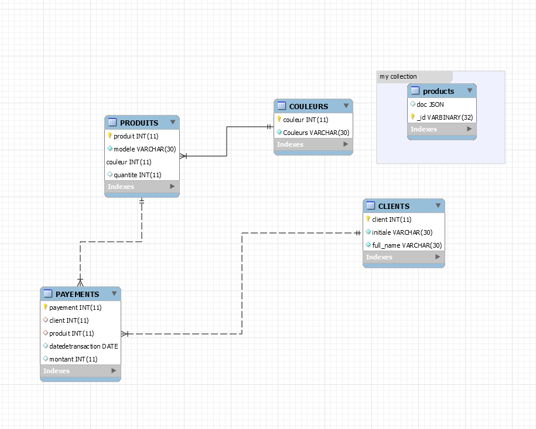

# hairasset

### :zero: Administration

- [] Créer son projet dans un répertoire :id:

```
$ cd ~/Developer/INF1086-200-20H-02/4.SQL-NoSQL
$ mkdir 300112917 && cd 300112917
```


- [] Créer le conteneur avec un volume (dans le répertoire de son projet)


:bulb: Le volume sert à charger le fichier `.json`


<sup>:m:</sup> sous `Powershell`

```
PS > docker container run `
         --name some-mysqlds `
         --env MYSQL_ROOT_PASSWORD=password `
         --publish 3306:3306 `
         --publish 33060:33060 `
         --volume C:\Users\djumaster\developer\INF1086-200-20H-02\4.SQL-NoSQL\300112917:/var/lib/mysql-files `
         --detach `
         mysql/mysql-server:latest
```

* En éxécutant la commande suivante vos fichiers dans les conteneurs devraient s'afficher

```
$ docker container exec --interactive some-mysqlds sh -c "ls /var/lib/mysql-files"
300112917-data.sql
300112917-schema.sql
README.md
products.json
```


- [] Création de la base de données `hairasset`

```
$ docker container exec --interactive some-mysqlds mysql --user root -ppassword \
                        --execute "CREATE DATABASE magasin;"
```

- []  DCL création de l'utilisateur

:pushpin: Contexte permettant d'utiliser `mysqlsh` 

```
$ docker container exec --interactive some-mysqlds mysql --user root -ppassword \
                        --execute "CREATE USER 'djumaster'@'127.0.0.1' IDENTIFIED BY 'password';"
$ docker container exec --interactive some-mysqlds mysql --user root -ppassword \
                        --execute "GRANT ALL ON magasin.* TO 'ador'@'127.0.0.1';"
```

:pushpin: Contexte permettant d'utiliser `Mysql Workbench` 


```
$ docker container exec --interactive some-mysqlds mysql --user root -ppassword \
                        --execute "CREATE USER 'djumaster'@'%' IDENTIFIED BY 'password';"
$ docker container exec --interactive some-mysqlds mysql --user root -ppassword \
                        --execute "GRANT ALL ON hairasset.* TO 'djumaster'@'%';"
```

### :one: Migration

:bulb: Récupération et chargement de la base de données `hairasset`

- [] Charger le `schema`

```
$ docker container exec --interactive some-mysqlds mysql --user root -ppassword \
          hairasset < ~/Developer/INF1086-200-20H-02/4.SQL-NoSQL/300112917/300112917-schema.sql
```

- [] Charger les données SQL

```
$ docker container exec --interactive some-mysqlds mysql --user root -ppassword \
         hairasset < ~/Developer/INF1086-200-20H-02/4.SQL-NoSQL/300112917/300112917-data.sql
```

### :two: ETL

- [] Chercher des données `JSON`

```
$ curl https://raw.githubusercontent.com/pbrain19/VitoMazzaSAlon/master/public/js/data/products.json
```

- [] Importer ces données dans vos propres collections

:pushpin: Se connecter au conteneur

```
$ docker container exec --interactive --tty some-mysqlds bash
```

:pushpin: Se connecter à mysql SH en utilisant `JavaScript`

```
bash-4.2# mysqlsh --js --host localhost --user djumaster --password
```

:pushpin: Importer les fichiers `json` (i.e. ETL)

* products.json

```
MySQL JS> util.importJson(
              "/var/lib/mysql-files/products.json", 
              {
                  schema: "hairasset", 
                  collection: "products"
              }
          )
```

:pushpin: Tester la collection

```
MySQL  JS > \use hairasset;
MySQL  JS > db.products.find()
```

### :four: Modèlisation

Le modèle doit comporter l'image du schema et le fichier export :id:-dumb.sql (i.e. forward engineering)

- [] présenter votre modèle relationel

- [] présenter votre modèle présentant les collections `dans un dossier`

</img>


### :five: Backup

- [x] Sauvegarder la base de données dans un fichier SQL nommé 🆔-dump.sql
 
```
$ docker container exec some-mysqlds \
    sh -c 'exec mysqldump --user root -p"$MYSQL_ROOT_PASSWORD" hairasset ' \
    > ~/Developer/INF1086-200-20H-02/4.SQL-NoSQL/300112917/300112917-dump.sql
```
