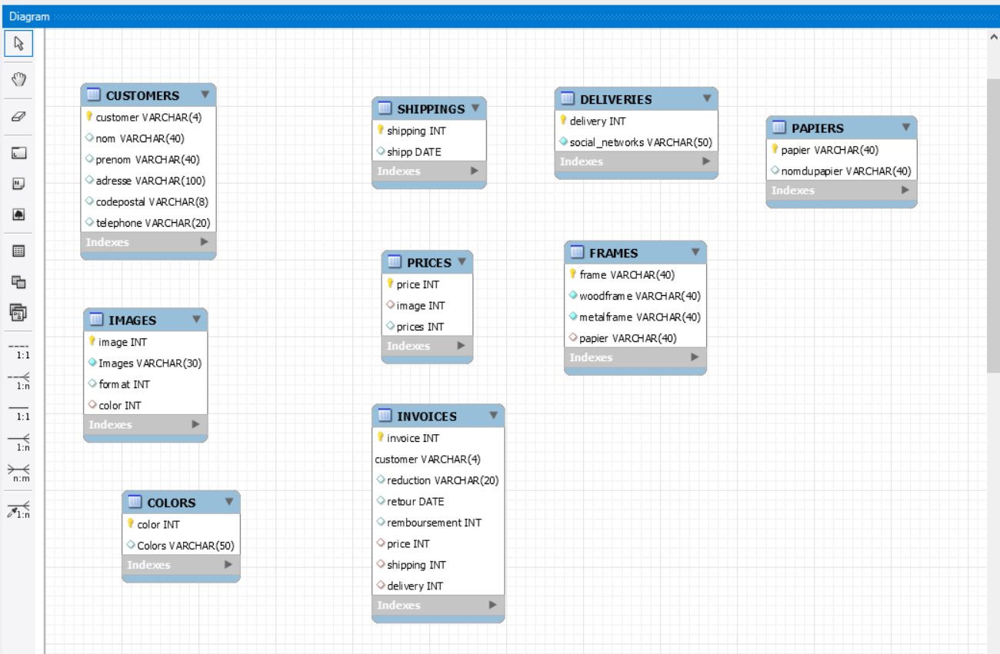
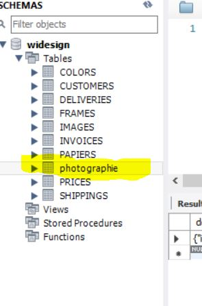
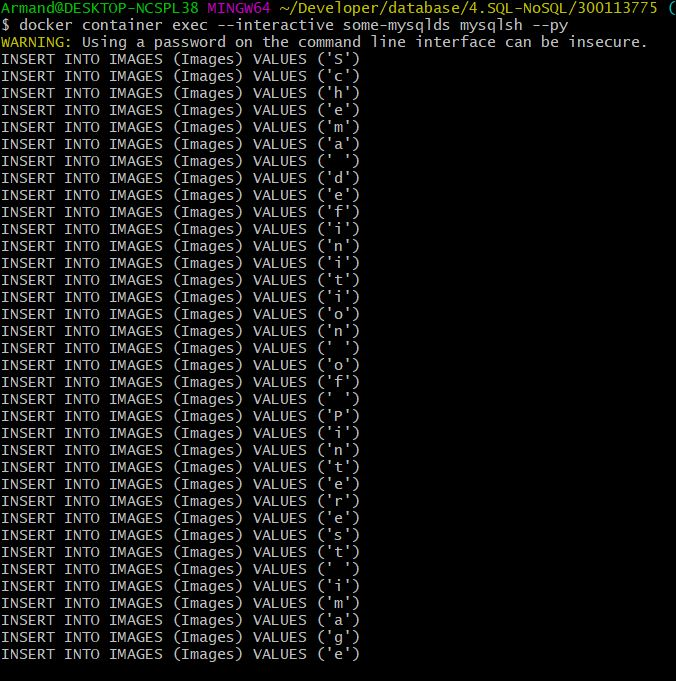
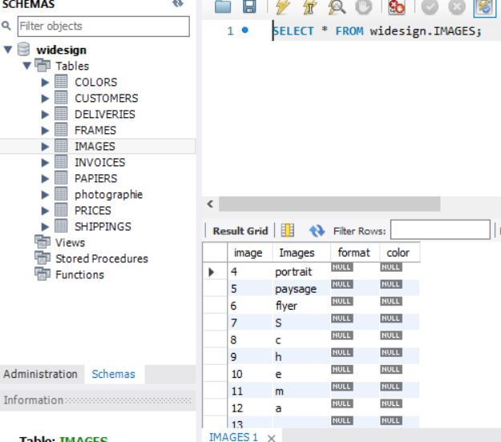

# WIDESIGN 

####Les relations ne s'affichent pas sur mon workbench

### :zero: Administration

- [x] Créer son projet dans un répertoire :id:

```
$ cd ~/Developer/INF1086-200-20H-02/4.SQL-NoSQL
$ mkdir <300113775> && cd <300113775>
```


- [x] Créer le conteneur avec un volume (dans le répertoire de son projet)


:bulb: Le volume sert à charger le fichier `.json`


<sup>:m:</sup> sous `Powershell` 

```
PS > docker container run `
         --name some-mysqlds `
         --env MYSQL_ROOT_PASSWORD=password `
         --publish 3306:3306 `
         --publish 33060:33060 `
         --volume C:\Users\Armand\Developer\database\4.SQL-NoSQL\300113775:/var/lib/mysql-files `
         --detach `
         mysql/mysql-server:latest
```

* En éxécutant la commande suivante vos fichiers dans les conteneurs devraient s'afficher

```
$ docker container exec --interactive some-mysqlds sh -c "ls /var/lib/mysql-files"
300113775-data.sql
300113775-schema.sql
README.md
photo.json
```


- [] Création de la base de données `widesign`

```
$ docker container exec --interactive some-mysqlds mysql --user root -ppassword \
                        --execute "CREATE DATABASE widesign;"
```

- []  DCL création de l'utilisateur

:pushpin: Contexte permettant d'utiliser `mysqlsh` 

```
$ docker container exec --interactive some-mysqlds mysql --user root -ppassword \
                        --execute "CREATE USER 'widby'@'127.0.0.1' IDENTIFIED BY 'Password123';"
$ docker container exec --interactive some-mysqlds mysql --user root -ppassword \
                        --execute "GRANT ALL ON widesign.* TO 'widby'@'127.0.0.1';"
```

:pushpin: Contexte permettant d'utiliser `Mysql Workbench` 


```
$ docker container exec --interactive some-mysqlds mysql --user root -ppassword \
                        --execute "CREATE USER 'widby'@'%' IDENTIFIED BY 'Password123';"
$ docker container exec --interactive some-mysqlds mysql --user root -ppassword \
                        --execute "GRANT ALL ON widesign.* TO 'widby'@'%';"
```

### :one: Migration

:bulb: Récupération et chargement de la base de données `widesign`

- [] Charger le `schema`

```
$ docker container exec --interactive some-mysqlds mysql --user root -ppassword \
          widesign < ~/Developer/INF1086-200-20H-02/4.SQL-NoSQL/300113775/300113775-schema.sql
```

- [] Charger les données SQL

```
$ docker container exec --interactive some-mysqlds mysql --user root -ppassword \
         widesign < ~/Developer/INF1086-200-20H-02/4.SQL-NoSQL/300113775/300113775-data.sql
```


### :two: ETL

- [] Chercher des données `JSON`

[photo.json](photo.json) * https://raw.githubusercontent.com/pinterest/plank/master/Examples/PDK/image.json


```
$ curl https://raw.githubusercontent.com/pinterest/plank/master/Examples/PDK/image.json > photo.json
```

- [] Importer ces données dans vos propres collections

:pushpin: Se connecter au conteneur

```
$ docker container exec --interactive --tty some-mysqlds bash
```

:pushpin: Se connecter à mysql SH en utilisant `JavaScript`

```
bash-4.2# mysqlsh --js --host localhost --user widby --password
```

:pushpin: Importer les fichiers `json` (i.e. ETL)

* photo.json

```
MySQL JS> util.importJson(
              "/var/lib/mysql-files/photo.json", 
              {
                  schema: "widesign", 
                  collection: "photographie"
              }
          )
```


:pushpin: Tester la collection

```
MySQL  JS > \use widesign;
MySQL  JS > db.photographie.find()

```

### :three: Scripting avec API

:pushpin: Utilisation de MySQL Python : XDEVAPI 

- [x] La fonction mashup doit gérer une table produite par des collections

Écrire le programme python [b300113775.py](b300113775.py) permettant de rajouter des étudiants importés par le fichier `widesign.json`

```
$ docker container exec --interactive some-mysqlds mysqlsh --py \
                        --host localhost --user widby -pPassword123 \
                   < ~/Developer/INF1086-200-20H-02/4.SQL-NoSQL/300113775/b300113775.py

```
### :four: Modeling
💡 

</img>
</img>
</img>
</img>

### :five: Backup

- [x] Sauvegarder la base de données dans un fichier SQL nommé 🆔-dump.sql
```docker container exec some-mysqlds \
    sh -c 'exec mysqldump --user root -p"$MYSQL_ROOT_PASSWORD" widesign ' \
    > ~/Developer/INF1086-200-20H-02/4.SQL-NoSQL/300113775/300113775-dump.sql
```

