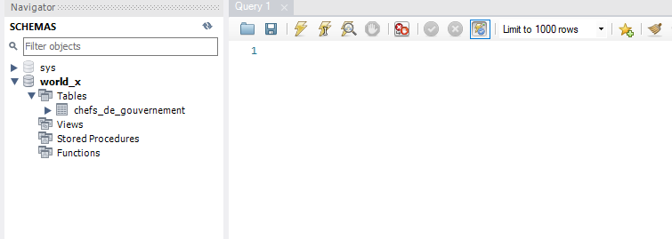
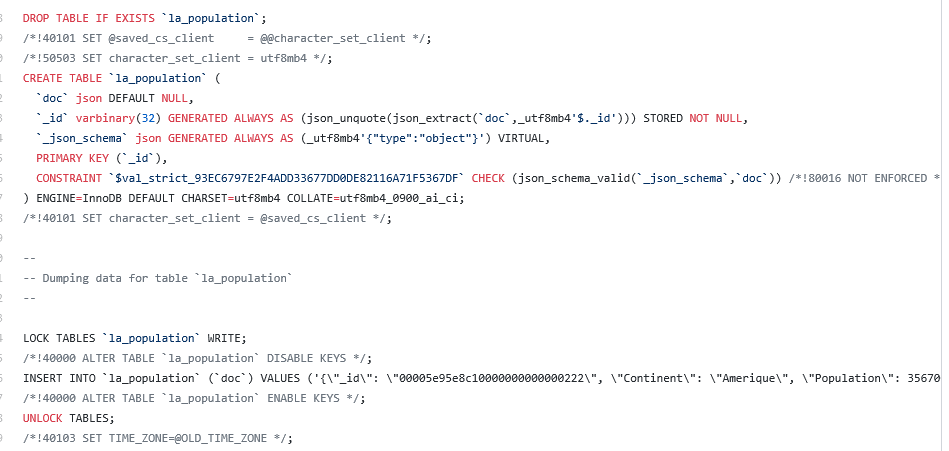

🎈


# Programmation MySQLsh en Python

Salut, 

Dans ce tutoriel, je vas créer un programme utilisant les APIs de MySQL X Dev API en Python


## installer la base de donnée MySQL Server

:one: Créer le conteneur `some-mysqlds`

:pushpin: sous Powershell

```
PS> docker container run `
         --name some-mysqlds `
         --env MYSQL_ROOT_PASSWORD=password `
         --publish 3306:3306 `
         --publish 33060:33060 `
         --detach `
         mysql/mysql-server:latest
```

:two: Créer la base de données `world_x`

:pushpin: sous PowerShell

```
PS > docker container exec --interactive some-mysqlds mysql `
                        --user root --password=password `
                        --execute "CREATE DATABASE world_x;"
```


:three: Créer l'utilisateur `root` sous le sous-réseau déterminé par le pont 

* Pour creer l'utilisateur : `'root'@'172.17.0.1'`

```
PS > docker container exec --interactive some-mysqlds `
                mysql --user root --password=password `
                --execute "CREATE USER 'root'@'172.17.0.1' IDENTIFIED BY 'password';"
```

* Pour donner les droits d'accès à n'importe quelle base de données

```
PS > docker container exec --interactive some-mysqlds `
                mysql --user root --password=password `
                --execute "GRANT ALL ON *.* TO 'root'@'172.17.0.1';"
```

## X DevAPI en Python


:four: Installer MySQL Connector Python avec pip

```
PS > pip install mysql-connector-python
```
:round_pushpin: Vérifier l'installaiton du connecteur MySQL 

```
PS > pip show mysql-connector-python 
```
Version: 8.0.19

## Cloner le référentiel

Dans un terminal tapes `git clone https://github.com/halimabzn/lab-programmation-mysqlsh-en-python`, en chosissant la version `SSH` 


## :one: Écrire le programme Python

📌 Utilisation de variables: Dans cette section, on va créer deux variables session et db

* "la variable session" : permet d'obtenir une session d'entrée auprès de la base world_x .

* "la variable db": permet de guarder l'information de la base .

📌 Charger la collection temporaire:

* lire et convertir le fichier en format JSON en format du Document Store en utilisant la fonction "lectur", Ce Document sera stoqué dans une collection
 
📌Traverser la collection: 

En utilisant la fonction fetch. fetch se décline en deux configurations:

- par la récupération entière (d'un coup) des documents fetch_all

- par la récupération individuelle fetch_one

📌Rajouter manuellement un document

En utilisant "maColl.add"


## :two: Vérification: 

- [x] Copier le programme et le script SQL:	

- [x] Créer votre fichier README.md expliquant votre programme	

* [x] Extraire une autre collection de world_x que les chefs de gouvernements	




## :three: Amélioration	


* [x] Extraire une autre collection de world_x que Population





🎈
