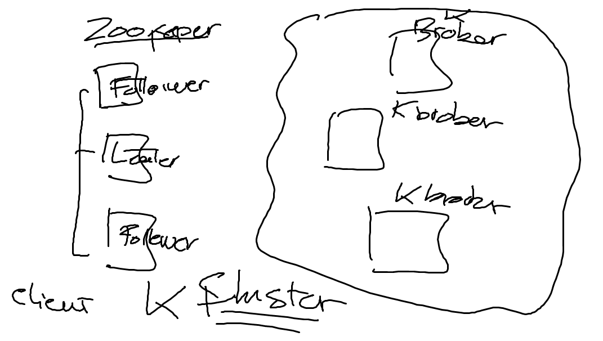

# Architecture

:o: Prérequis

Installation de la [VM](VM)

## Kafka Theory

https://www.lynda.com/Kafka-tutorials/Kafka-theory-overview/777399/803705-4.html

## Realtime

## DB Types

## Req/Res vs Pub/Sub

## Kafka Architecture

## Kafka Cluster

## Kafka Patterns

# Base 

## Equivalent d'un Message Broker

## Géré en grappes (Cluster)

## Géré en grappes (Cluster)

## Les Topics peuvent etre vu comme une table

## Les topics peuvent etre lus en groupes

## Les messages sont appellé offsets et contenu dans des fichier logs

