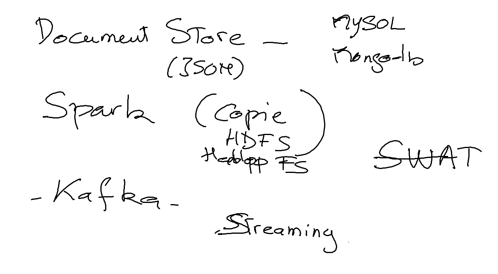

# INF1086-200-20H-02
Administration de base de données

```
Topic: CBCV-218170  INF1086/2/Face à face  Administration de base de données - Brice Robert
Time: This is a recurring meeting Meet anytime

Join Zoom Meeting
https://collegeboreal.zoom.us/j/193120028

One tap mobile
+16473744685,,193120028# Canada
+16475580588,,193120028# Canada

Dial by your location
        +1 647 374 4685 Canada
        +1 647 558 0588 Canada
        +1 778 907 2071 Canada
        +1 438 809 7799 Canada
        +1 587 328 1099 Canada
        855 703 8985 Canada Toll-free
Meeting ID: 193 120 028
Find your local number: https://collegeboreal.zoom.us/u/axPBnQGUF
```

## Devoirs

| Date   |                     |     Commentaires                                                                         |
|:------:|:--------------------|:-----------------------------------------------------------------------------------------|
|14-01-20| [DS](./1.DS)        | MySQL Document Store                                                                     |


## Déroulement de cours:

|# | Semaine|                                          |     Commentaires                                                   |
|--|:------:|:-----------------------------------------|:-------------------------------------------------------------------|
|01|06-01-20|                                          | Rentrée des classes                                                |
|02|13-01-20| Part 1                                   | MySQL - Document Store                                             |
|03|20-01-20|                                          |                                                                    |
|04|27-01-20| Part 2                                   | Spark                                                              |
|05|03-02-20|                                          |                                                                    |
|06|10-02-20|                                          |                                                                    |
|07|17-02-20| Part 3                                   | Kafka                                                              |
|08|24-02-20| Semaine d'études                         | Pas de cours                                                       |
|09|02-03-20|                                          |                                                                    |
|10|09-03-20|                                          |                                                                    |
|11|16-03-20|                                          |                                                                    |
|12|23-03-20|                                          |                                                                    |
|13|30-03-20| TBD                                      | TBD                                                                |
|14|06-04-20| TBD                                      | TBD                                                                |
|15|13-04-20| TBD                                      | TBD                                                                |

# Références


—


## Thêmes

 
